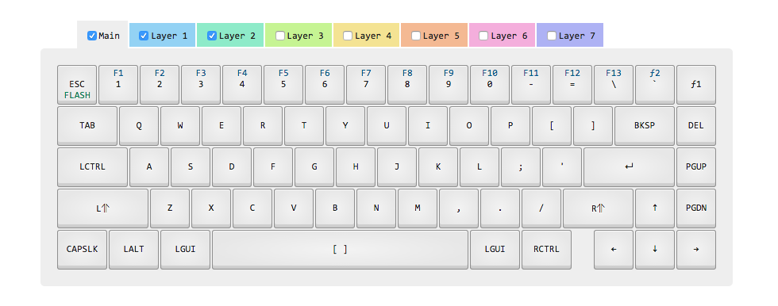

#WhiteFox Layout

Provided by the [Input Club Configurator](https://input.club/configurator) and customized by me. 

 

##Install
Simply enter the directory, flash the keyoard (which you should set a key to on a layer), and run `dfu-util -D kiibohd.dfu.bin`.

Note: This layout includes the flash function. Access this by holding the ƒ1 to access ƒ2 (`~`) and hit `esc`

See my [Ergodox Layout](https://github.com/NickCalabs/ErgodoxLayout) as well. 